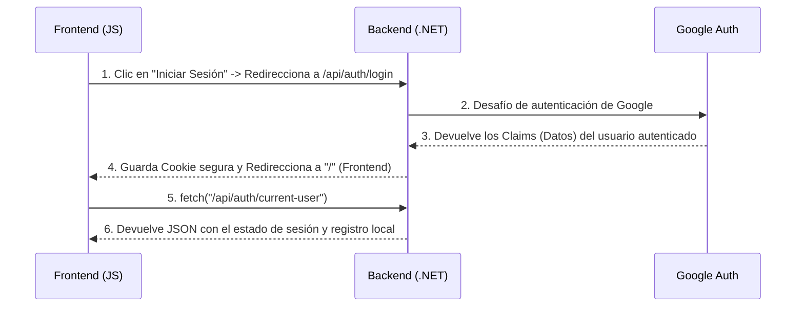

# Guía de Conexión: Integración Backend (.NET) y Frontend (Vanilla JS)

Este documento explica de forma clara y detallada cómo se conecta el Frontend (diseñado en HTML/JS) con el Backend (.NET 10 Web API), analizando las líneas de código específicas que hacen posible esta comunicación y el flujo lógico del sistema.

---

## 🏗️ 1. Arquitectura de Puerto Único (Mismo Origen)

Tradicionalmente, en desarrollo se suele correr el Frontend en un puerto (ej. `http://localhost:3000`) y el Backend en otro (ej. `http://localhost:5098`). Esto genera problemas de **CORS (Cross-Origin Resource Sharing)** y dificulta el manejo de cookies de sesión seguras.

**Nuestra Solución:** 
El backend aloja y sirve directamente los archivos del frontend. Ambas partes corren bajo **`http://localhost:5098`**. 
* **Ventaja:** No se requiere configurar políticas de CORS.
* **Seguridad:** El navegador envía automáticamente las cookies de autenticación en cada petición `fetch` al backend sin intervención del desarrollador.

En **[Program.cs](file:///e:/Users/moggamex/Documents/moggamex/todo/learn/campuslands/Net/practica/AuthGoogle/Api/Program.cs)** configuramos esta unión:
```csharp
// Le indicamos al servidor que la raíz web ("wwwroot") es nuestra carpeta Client
var clientPath = Path.GetFullPath(Path.Combine(Directory.GetCurrentDirectory(), "..", "Client"));
var builder = WebApplication.CreateBuilder(new WebApplicationOptions
{
    Args = args,
    WebRootPath = clientPath
});

// ...

// Habilitamos la carga de index.html por defecto y el middleware de archivos estáticos
app.UseDefaultFiles();
app.UseStaticFiles();
```

---

## 🔄 2. Flujo Completo de Autenticación con Google

La comunicación sigue un ciclo cerrado muy elegante entre el navegador, nuestra API y los servidores de Google:



### Líneas de Código Clave del Flujo de Autenticación:

1. **Frontend - Redirección al Login:**
   En **[app.js](file:///e:/Users/moggamex/Documents/moggamex/todo/learn/campuslands/Net/practica/AuthGoogle/Client/app.js)**, el botón de login simplemente redirige la barra de navegación al endpoint de login del backend:
   ```javascript
   authHeaderAction.innerHTML = `
       <a href="/api/auth/login" class="btn btn-primary">
           <i class="fa-brands fa-google"></i> Iniciar Sesión con Google
       </a>
   `;
   ```

2. **Backend - Redirección de Retorno:**
   Una vez que Google valida al usuario, el backend en **[AuthController.cs](file:///e:/Users/moggamex/Documents/moggamex/todo/learn/campuslands/Net/practica/AuthGoogle/Api/Controllers/AuthController.cs)** establece la sesión y **redirecciona al usuario de vuelta a la raíz `/`** para que recargue el frontend:
   ```csharp
   [HttpGet("google-response")]
   public async Task<IActionResult> GoogleResponse()
   {
       var result = await HttpContext.AuthenticateAsync(CookieAuthenticationDefaults.AuthenticationScheme);
       if (!result.Succeeded || result.Principal == null)
       {
           return Redirect("/?error=auth_failed");
       }
       return Redirect("/"); // Redirección automática al frontend
   }
   ```

---

## 👤 3. Comprobación y Registro de Usuario

Cuando el frontend carga, realiza una petición en segundo plano para saber quién es el usuario y si ya está registrado en nuestra base de datos PostgreSQL.

### 1. ¿Quién es el usuario actual?
En **[app.js](file:///e:/Users/moggamex/Documents/moggamex/todo/learn/campuslands/Net/practica/AuthGoogle/Client/app.js)**:
```javascript
async function checkSession() {
    const response = await fetch("/api/auth/current-user");
    const data = await response.json();
    currentUser = data; // Contiene: { isAuthenticated, isRegistered, googleId, nombre, email }
    updateUI();
}
```

En **[AuthController.cs](file:///e:/Users/moggamex/Documents/moggamex/todo/learn/campuslands/Net/practica/AuthGoogle/Api/Controllers/AuthController.cs)**, el endpoint lee los datos de la cookie segura de autenticación:
```csharp
[HttpGet("current-user")]
public async Task<IActionResult> GetCurrentUser()
{
    var result = await HttpContext.AuthenticateAsync(CookieAuthenticationDefaults.AuthenticationScheme);
    if (!result.Succeeded || result.Principal == null)
    {
        return Ok(new { IsAuthenticated = false });
    }

    var googleId = result.Principal.FindFirstValue(ClaimTypes.NameIdentifier);
    var nombre = result.Principal.FindFirstValue(ClaimTypes.Name);
    var email = result.Principal.FindFirstValue(ClaimTypes.Email);

    // Verificamos si existe en la base de datos de PostgreSQL
    var usuarioExistente = await _userService.GetByGoogleIdAsync(googleId);

    return Ok(new {
        IsAuthenticated = true,
        IsRegistered = usuarioExistente != null,
        GoogleId = googleId,
        Nombre = nombre,
        Email = email
    });
}
```

### 2. Registrar la cuenta localmente
Si `isRegistered` es `false`, el Frontend muestra un botón para registrarse. Al hacer clic, hace un **`POST` con JSON**:

En **[app.js](file:///e:/Users/moggamex/Documents/moggamex/todo/learn/campuslands/Net/practica/AuthGoogle/Client/app.js)**:
```javascript
const response = await fetch("/api/auth/register", {
    method: "POST",
    headers: { "Content-Type": "application/json" },
    body: JSON.stringify({
        googleId: currentUser.googleId,
        nombre: currentUser.nombre,
        email: currentUser.email
    })
});
if (response.ok) {
    await checkSession(); // Recargamos para actualizar a la interfaz de notas
}
```

---

## 📝 4. Carga y Creación de Notas

Una vez registrado, el usuario puede ver y escribir notas. La conexión se realiza directamente a la tabla `Notas` mediante el identificador único `googleId`.

### 1. Obtener las notas del usuario (GET)
El Frontend solicita las notas asociadas al `googleId` del usuario autenticado:

En **[app.js](file:///e:/Users/moggamex/Documents/moggamex/todo/learn/campuslands/Net/practica/AuthGoogle/Client/app.js)**:
```javascript
const response = await fetch(`/api/notes/${currentUser.googleId}`);
const notes = await response.json(); // Array de objetos nota
renderNotes(notes); // Dibuja las tarjetas en la grilla HTML
```

En **[NotesController.cs](file:///e:/Users/moggamex/Documents/moggamex/todo/learn/campuslands/Net/practica/AuthGoogle/Api/Controllers/NotesController.cs)**:
```csharp
[HttpGet("{googleId}")]
public async Task<IActionResult> GetByGoogleId(string googleId)
{
    var notas = await _noteService.GetByGoogleIdAsync(googleId);
    return Ok(notas);
}
```

### 2. Crear una nueva nota (POST)
Cuando el usuario rellena el modal y pulsa "Guardar Nota":

En **[app.js](file:///e:/Users/moggamex/Documents/moggamex/todo/learn/campuslands/Net/practica/AuthGoogle/Client/app.js)**:
```javascript
const response = await fetch("/api/notes", {
    method: "POST",
    headers: { "Content-Type": "application/json" },
    body: JSON.stringify({
        googleId: currentUser.googleId,
        titulo: titleVal,
        contenido: contentVal
    })
});
if (response.ok) {
    hideModal();     // Cierra el formulario
    await loadNotes(); // Recarga la lista para mostrar la nueva nota inmediatamente
}
```

En **[NotesController.cs](file:///e:/Users/moggamex/Documents/moggamex/todo/learn/campuslands/Net/practica/AuthGoogle/Api/Controllers/NotesController.cs)**:
```csharp
[HttpPost]
public async Task<IActionResult> Create([FromBody] CreateNoteRequest request)
{
    var nota = await _noteService.CreateAsync(request.GoogleId, request.Titulo, request.Contenido);
    return Ok(nota);
}
```

---

## 🔑 Resumen Teórico
* **JSON:** Es el idioma común. El frontend serializa datos a JSON usando `JSON.stringify()`, y el backend los interpreta automáticamente usando el decorador `[FromBody]`.
* **Rutas relativas:** Como estamos en el mismo puerto, no escribimos `http://localhost:5098/api/notes`, simplemente escribimos `/api/notes`. Esto hace que el código sea portátil (funcionará igual si lo subes a un servidor en internet).
* **Cookies de Sesión:** .NET maneja la sesión de forma encriptada en el navegador. Cada llamada a `fetch` incluye la firma del usuario sin que nosotros tengamos que meter tokens manualmente en las cabeceras.
